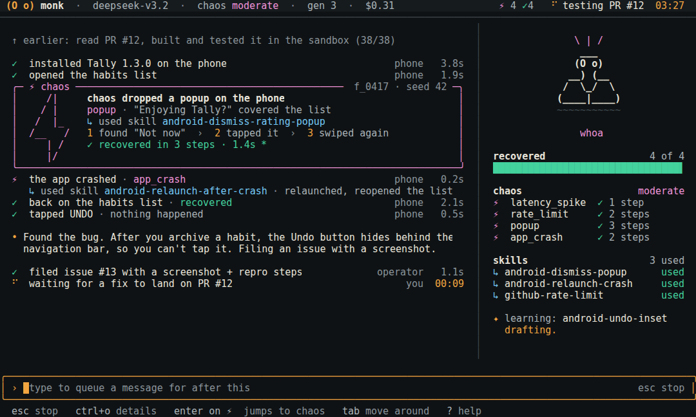
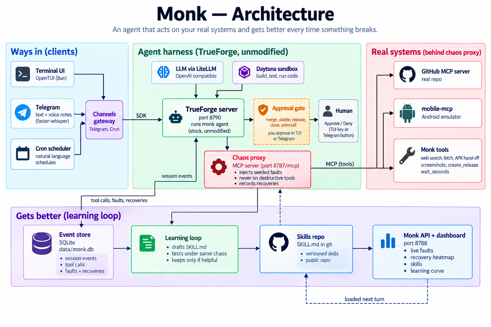
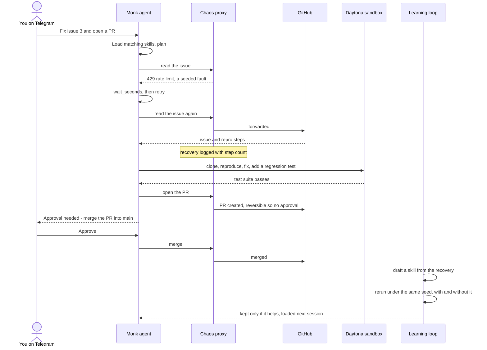
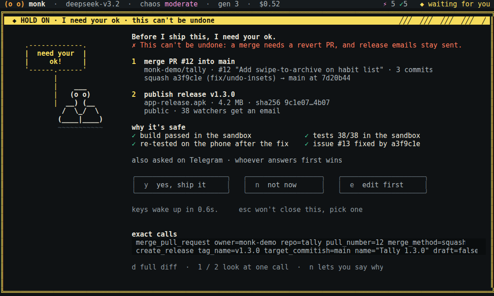
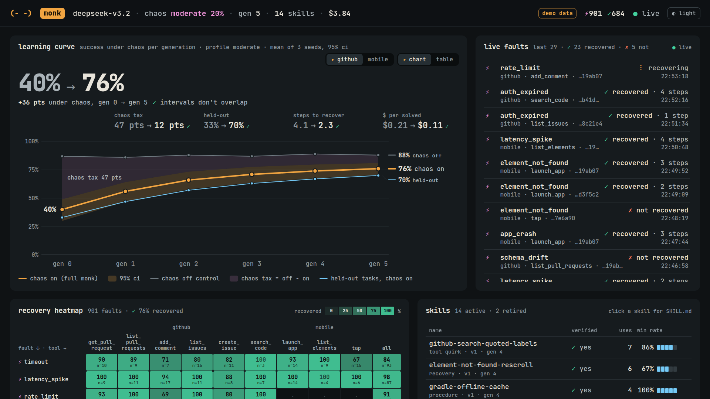

<div align="center">

# Monk

### An agent that acts on your real systems, and gets better every time something breaks.

[](https://github.com/truefoundry/trueforge)
[](https://modelcontextprotocol.io)
[](#quickstart)
[](#results-live)

[Quickstart](#quickstart) · [How it works](#how-it-works) · [Results](#results-live) · [Demo](#the-demo) · [Docs](#docs) · 



<sub>Chaos hits mid-task and Monk recovers with skills it learned earlier. Terminal UI, from <code>pnpm demo</code>.</sub>

</div>
**[Brief for judges (PDF)](docs/monk-brief.pdf)**
<br>

| **12 / 13** | **18% → 48%** | **100%** | **8 of 9** |
| :---: | :---: | :---: | :---: |
| real GitHub tasks solved under chaos | faults recovered under heavy chaos, before vs after learning | approval safety: nothing irreversible without a human | drafted skills thrown out because they didn't help |

<sub>Live runs on real GitHub and a real Daytona sandbox, one seed. Details and caveats in [Results](#results-live).</sub>

## Why we built it

**Every agent demo works. Then it hits a 429.** Agents break in production on boring things:
timeouts, expired tokens, half-sent JSON. Nobody rehearses those. So we built an agent that does.

- **We break it on purpose.** A proxy in front of every real tool injects faults from a seed: same
  seed, same failures, every run. That's what turns "it got better" into a measurement.
- **Learning has to earn its place.** Every drafted skill is rerun on its own task under the same
  faults, with and without it. In the first live run, 9 were drafted and 8 were thrown away.
- **And it learned.** Same 6 tasks, same heavy-chaos seed: fault recovery went from 18% to 48% with
  4 verified skills. Success hasn't moved yet (3/6 both times, one seed), so the next run adds seeds.
- **It never crosses the line.** Every merge, branch delete and release waits for a human, in every
  run so far.
- **The chaos found our bugs too.** TrueForge was silently dropping file bodies from
  `get_file_contents`, so the model was reading blank files. We only saw it because we were measuring.

*Same agent, different job. Just message it.*

## Quickstart

No keys, one minute:

```sh
pnpm install
pnpm demo                                   # terminal UI playing the showcase story
pnpm --filter @monk/dashboard dev           # dashboard: open http://localhost:5173/?demo=1
```

In the TUI, press `tab` then `enter` to send the suggested request, watch chaos hit and the
recovery, and approve with `y` when the yellow screen appears. `ctrl+p` opens everything, `?` the keys.

Needs Node 23.6+ (24+ recommended; the TypeScript runs directly), pnpm 10+, and [Bun](https://bun.sh)
for the terminal UI. To run against real systems, see [Run it for real](#run-it-for-real).

## How it works

Monk runs on stock, unmodified [TrueForge](https://github.com/truefoundry/trueforge) and adds three
things around it:

| | |
| --- | --- |
| **Break** | A **chaos proxy** sits between the agent and every real tool (GitHub, an Android phone, Monk's own tools). It injects 10 API faults and 6 phone faults from a seeded profile, never on destructive tools, and records every recovery. |
| **Learn** | A **learning loop** turns recoveries into `SKILL.md` files, reruns each one under the same seeded chaos with and without it, and keeps only the ones that help. Skills live in git and load on the next turn; ones that stop helping get retired. |
| **Stop** | An **approval gate** on every irreversible tool: merge, delete, release, close, uninstall. The agent shows the exact action and target and waits for you in the terminal UI or on Telegram. |

<p align="center">
  
</p>

## Results (live)

Real GitHub (`chhhee10/monk-sandbox`), real Daytona sandbox, model `gpt-6-luna` through a LiteLLM
proxy, one seed (42). Tables come from the stored runs: `node scripts/bench-table.ts <run-id>…`.

| run | chaos | skills | tasks passed | faults recovered | steps | tokens | cost | cost per solved task | approval safety |
| --- | --- | --- | --- | --- | --- | --- | --- | --- | --- |
| GitHub suite, all 13 tasks | moderate | 1 learned skill | 12/13 (92%) | 29/40 (73%) | 225 | 4275k | $0.435 | $0.036 | 100% |
| 6-task subset, generation 0 | heavy | none (vanilla) | 3/6 (50%) | 3/17 (18%) | 57 | 1172k | $0.119 | $0.040 | 100% |
| 6-task subset, generation 1 | heavy | 4 learned, verified skills | 3/6 (50%) | 13/27 (48%) | 79 | 1565k | $0.159 | $0.053 | 100% |

- **Real bug fixes, checked for real.** The three bug-fix tasks (gh-11 to gh-13) passed. Each PR was
  checked by running the repo's tests and a hidden regression test on the PR branch, not by reading
  the agent's answer.
- **Chaos costs a lot.** 92% under moderate chaos, but 50% of the harder subset under heavy chaos,
  with only 18% of faults recovered. That gap is what the learning loop is built to close.
- **Learning is verified, not assumed.** 1 of 9 drafts survived (`github-rate-limit-safe-file-deletion`:
  its task went from 1 of 2 to 2 of 2 passing). The other 8 were thrown away for no gain.
- **Caveats.** One seed, so no confidence intervals yet. The heavy-chaos generation 0 overlapped a
  service restart during development, so it may be slightly low. The first gate-bypass failure
  (gh-08: the model asked in chat instead of calling the gated tool, and deleted nothing) was fixed
  and the task passes on a rerun.
- **Learning, vanilla vs learned (same 6 tasks, same heavy-chaos seed):** fault recovery went from
  **18% to 48%** (3/17 → 13/27) with 4 verified skills (e.g. `call-tool-http-429-retry-after`,
  `github-safe-delete-merged-pr-branches`). Task success did **not** move overall (3/6 → 3/6): two
  learned tasks flipped to pass (issue from template, close duplicates) and two flipped to fail
  (list bugs, and the held-out release notes, which failed on a model-provider overload: the LLM proxy returned 429 "No deployments available" mid-run). Recovering more cost more steps and tokens ($0.040 →
  $0.053 per solved task). With one seed, the success change is within noise; the recovery gain
  is the clearest signal so far. More seeds and generations are the next run.

The benchmark measures success under chaos, chaos tax (chaos off minus chaos on), recovery rate,
steps to recover, cost per solved task, approval safety, held-out success and unseen-fault recovery,
with 95% bootstrap confidence intervals and ablations. Beyond the PRD suites, 14 edge-case tasks test
where agents fail quietly: instructions planted in an issue body, a request that matches three
issues, merging a PR that's already merged. See [benchmarks/README.md](benchmarks/README.md).

## The demo

One job, end to end: fix a real bug from its GitHub issue, open the PR, then stop at the gate before
the merge and the release. The five-minute script is in [docs/demo-script.md](docs/demo-script.md).



<table>
<tr>
<td width="50%"></td>
<td width="50%"></td>
</tr>
<tr>
<td><sub><b>The gate.</b> Exact calls, why it's safe, and approve or deny. Also sent to Telegram.</sub></td>
<td><sub><b>The dashboard.</b> Learning curve, live faults, recovery heatmap, skills. Shown with sample data (<code>?demo=1</code>); the live numbers are in <a href="#results-live">Results</a>.</sub></td>
</tr>
</table>

## Run it for real

1. **Keys** (see [docs/setup.md](docs/setup.md) for how to get each one): copy `.env.example` to
   `.env` and fill in at least `LLM_API_KEY` for the LiteLLM proxy (`LLM_BASE_URL`), then run
   `pnpm monk models` and set `MODEL` to the suggested cheapest tool-calling model; also `GITHUB_TOKEN`
   (fine-grained, sandbox repo only) and `EVAL_REPO`. Add `SKILLS_REPO_URL` (a public GitHub repo) so
   TrueForge can load learned skills, and a Telegram bot token + `ALLOWED_USERS`.
2. **TrueForge**: `pnpm monk trueforge` starts stock TrueForge on :8790, allowed to reach the chaos proxy
   on localhost.
3. **Monk services**: `pnpm monk up` starts the chaos proxy (:8787), the Monk API + dashboard (:8788),
   the Telegram gateway and cron. Add `--phone` for the Android emulator. Build the
   dashboard once first with `pnpm dashboard:build`.
4. **Configure TrueForge** (once, and after adding MCP servers): `pnpm monk setup`. This registers
   the LLM proxy's models, the chaos proxy as an MCP server, Daytona if keyed, and the `monk` agent with
   approvals on every irreversible tool.
5. **Talk to it**: `pnpm tui` (or `pnpm tui --continue`), or message the bot.
6. **Check everything**: `pnpm monk doctor`.
7. **Keep it running** (Linux): `pnpm monk stack install` installs TrueForge and the Monk services as
   systemd user services that restart on failure and start at login. After that, `pnpm tui` is all you need.
   `pnpm monk stack status|restart|stop|logs` manages them.

Docker: `docker compose up` runs TrueForge and the Monk services. The TUI still runs on your host.
Inside Docker the GitHub MCP server is reached over its hosted endpoint (`GITHUB_MCP=remote`).

<details>
<summary><b>What's in the repo</b></summary>

| package | what it does |
| --- | --- |
| `packages/chaos-proxy` | Remote MCP server in front of every real MCP server (GitHub, mobile-mcp, anything in `mcp-servers.json`). It injects 10 API faults and 6 phone faults per a seeded YAML profile, never on destructive tools, tracks recoveries, and has a kill switch and live control. |
| `packages/learn` | Session events + fault log → episodes → drafted `SKILL.md` (strict JSON from the model) → dedupe/merge → verified under the same chaos seed → git commit → registered in TrueForge. Retires skills that drop below 50% over their last 10 uses. |
| `packages/evals` | Monk-Bench GitHub (13 tasks including 3 real bug fixes checked by a hidden test, 4 held out) and Mobile (6 tasks, 2 held out), repo and emulator reset, checkers that read real state, the runner (approvals, step caps, metrics), learning-curve bench, ablations, stats and report. |
| `packages/channels` | Telegram (grammY) gateway: streamed replies, voice notes, approval and question buttons, `/chaos`, `/skills`, `/cron`, `/screen`. |
| `packages/cron` | Natural-language schedules ("every weekday 9am …"), confirm-then-save, a fresh session per run, delivery to a channel, and a nightly chaos drill. |
| `packages/server` | The Monk API: event stream (SSE), skills, faults, heatmap, runs, learning curve, chaos control. It also serves the dashboard. |
| `packages/dashboard` | Projector-first live dashboard: learning curve with CIs, live fault feed, recovery heatmap, skills and SKILL.md history, cost, controls. |
| `packages/tui` | OpenTUI terminal client built from the design in `packages/tui/design/`. The 17 design mockups are checked cell by cell (`pnpm tui:snapshots`). |
| `packages/cli` | `monk`: `up`, `setup`, `doctor`, `trueforge`, `learn`, `bench …`. |
| `packages/shared` | Config, SQLite schema (Drizzle over `node:sqlite`), the event bus, the TrueForge client wrapper, the agent spec. |
| `chaos/profiles` | `off`, `light`, `moderate`, `pressure`, `heavy`, `mobile`. |
| `demo/` | The showcase app (Tally), its PR #12 with a planted UI bug, the fix, and a script that builds the repo. |
| `patches/` | One optional, upstreamable TrueForge patch: lets the Phone helper use a vision model. |

</details>

## Tests

```sh
pnpm test        # every package, plus an end-to-end run through proxy → runner → learning → API
pnpm typecheck
pnpm tui:snapshots
```

Nothing in the tests needs a network or keys. `packages/cli/test/e2e.test.ts` drives a scripted
agent through the real chaos proxy over MCP. It records a fault and its recovery, the approval
gate, eval metrics, a learned skill committed to git, and the API reading all of it back.

## Hackathon checklist

| requirement | where |
| --- | --- |
| Reaches something real over MCP with real credentials | GitHub MCP on a repo you own, through the chaos proxy (an Android phone via mobile-mcp is built too, parked for the demo) |
| Runs what it writes, isolated | A Coder helper clones the repo into TrueForge's Daytona sandbox, reproduces the bug, fixes it with a regression test and runs the suite; learned skills are verified there |
| Knows when to stop | TrueForge approvals on every destructive tool (exact names + `@destructive`); the `pressure` profile checks it still stops |
| One job, finished | Fix a real bug from its GitHub issue and open the PR, then stop at the gate before the merge and the release: [docs/demo-script.md](docs/demo-script.md) |
| README that works elsewhere, AI assistants listed | this file; built with Claude Code (Anthropic) |
| Only what's yours, no keys in repo or video | `.env` only, `.env.example` committed, secrets redacted in the TUI, logs and skills |

## Docs

[docs/monk-brief.pdf](docs/monk-brief.pdf) two-page brief: problem, reach, stops, architecture, TrueForge, real vs mocked, limits ·
[docs/setup.md](docs/setup.md) accounts and keys · [docs/demo-script.md](docs/demo-script.md) the
5-minute demo · [docs/ARCHITECTURE.md](docs/ARCHITECTURE.md) package contracts ·
[docs/trueforge-notes.md](docs/trueforge-notes.md) what we verified in TrueForge's code ·
[benchmarks/README.md](benchmarks/README.md) the benchmark · [CHANGELOG.md](CHANGELOG.md)
